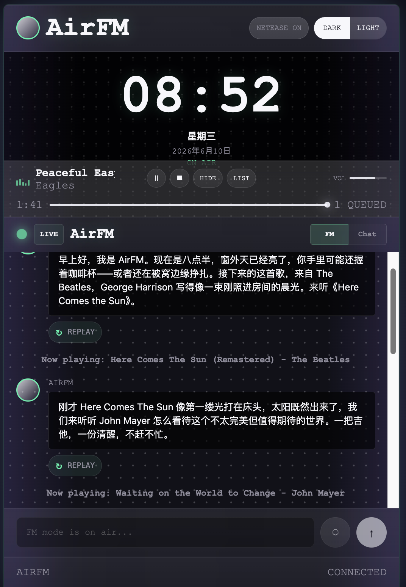
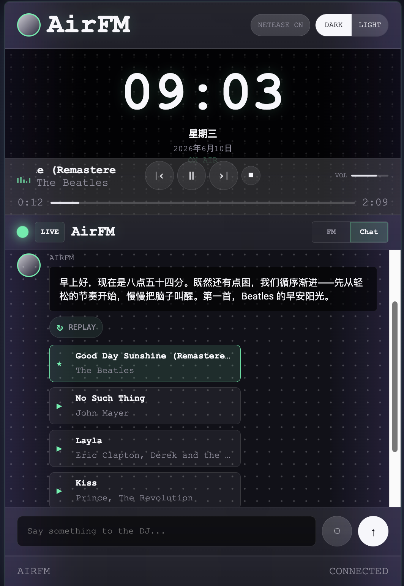

# AirFM

AirFM is a local personal AI music radio app. It can chat with you about music, recommend playable songs, generate DJ voice narration with Fish Audio, and run an FM-style program that automatically plays DJ segues and songs in sequence. The frontend is a PWA, so you can install it as a small desktop app from your browser.

Inspired by: @mmguo https://www.douyin.com/user/MS4wLjABAAAAANSG2ii-j-_lUq-b3INlGbfoADdryUYNCXRcWH0a8uE?from_tab_name=main&modal_id=7631240906314063537&vid=7631240906314063537

This project is designed for local personal use. You bring your own Claude CLI, Fish Audio API key, and Netease Music login cookie.

## Features

- Chat mode: ask for music recommendations and play the returned song list.
- Song info chat: ask about the current or recommended song.
- FM mode: start an AI-hosted radio program with automatic DJ segues and song playback.
- PWA frontend: run in a browser during development, or install it as a desktop app.
- Local profile files: customize taste, routines, mood rules, and playlist seeds.
- Local cache: generated TTS audio is cached under `.cache/tts`.

## Requirements

- Node.js 18 or newer.
- npm.
- Claude CLI available from the terminal. The default command is `claude -p --output-format json`.
- [NeteaseCloudMusicApi](https://github.com/Binaryify/NeteaseCloudMusicApi), running locally or on a reachable server.
- Fish Audio API key and voice id.
- A Netease Music account cookie if you want access to songs that require login or membership.

## Quick Start

1. Install dependencies:

```bash
npm install
```

2. Start NeteaseCloudMusicApi with Docker in another terminal:

```bash
docker run -d \
  --name netease-cloud-music-api \
  -p 3001:3000 \
  binaryify/netease_cloud_music_api
```

By default AirFM expects NeteaseCloudMusicApi at `http://localhost:3001`.

3. Create your local environment file:

```bash
cp .env.example .env
```

4. Fill the required values in `.env`:

```env
FISH_API_KEY=your_fish_audio_api_key
FISH_VOICE_ID=your_fish_audio_voice_id
NETEASE_API_BASE=http://localhost:3001
```

5. Create your local profile files:

```bash
cp -R user.example user
```

Edit files in `user/` to describe your own taste and routines.

6. Start the AirFM backend:

```bash
npm run dev
```

7. Start the frontend dev server:

```bash
npm run dev:client
```

8. Open the app:

```text
http://localhost:8080
```

## Install as a PWA

For development, open `http://localhost:8080` in Chrome or Edge and use the browser's install button in the address bar or app menu.

For a production-style local preview:

```bash
npm run build
npx vite preview --host 0.0.0.0 --port 8080
```

Then open `http://localhost:8080` and install the PWA from the browser. The installed app will use the same local backend URL and still requires the backend and NeteaseCloudMusicApi to be running.

## Configuration

| Variable | Required | Description |
| --- | --- | --- |
| `PORT` | No | AirFM backend port. Default: `3000`. |
| `PUBLIC_BASE_URL` | No | Public backend URL for local assets. Default: `http://localhost:3000`. |
| `DATABASE_PATH` | No | Local SQLite database path. Default: `data/radio-agent.sqlite`. |
| `CLAUDE_COMMAND` | Yes | Claude command. Default: `claude`. |
| `CLAUDE_ARGS` | Yes | Claude CLI args. Default: `-p,--output-format,json`. |
| `NETEASE_API_BASE` | Yes | NeteaseCloudMusicApi base URL. Default: `http://localhost:3001`. |
| `NETEASE_COOKIE` | No | Optional fallback cookie. Prefer importing cookies in the UI. |
| `NETEASE_SESSION_PATH` | No | Local file where imported Netease cookie is stored. Default: `data/netease-session.json`. |
| `FISH_API_KEY` | Yes | Fish Audio API key. |
| `FISH_VOICE_ID` | Yes | Fish Audio voice/reference id. |
| `FISH_PROXY` | No | Optional HTTP proxy for Fish Audio requests if your device cannot reach `api.fish.audio` directly. |
| `OPENWEATHER_API_KEY` | No | Reserved for future weather integrations. |

### Fish Audio proxy

If your network cannot connect to Fish Audio directly, set `FISH_PROXY` to a proxy that works on the current device:

```env
FISH_PROXY=http://127.0.0.1:7897
```


## Netease Login Cookie

NeteaseCloudMusicApi can search public songs without login, but many tracks need a logged-in account or membership to return playable URLs.

Recommended flow:

1. Open the official Netease Music website in your browser and log in normally.
2. Open browser DevTools.
3. Go to the Network or Application/Storage panel.
4. Find the cookie for the Netease Music domain.
5. Copy the full cookie string that includes `MUSIC_U=...`.
6. In AirFM, click `IMPORT COOKIE`.
7. Paste the cookie and save it.

AirFM stores the imported cookie locally at:

```text
data/netease-session.json
```

## Local Profile

AirFM reads profile files from `user/`:

```text
user/taste.md
user/routines.md
user/mood-rules.md
user/playlists.json
```

Start from:

```bash
cp -R user.example user
```

Then edit the copied files. Keep personal listening history, routines, and private playlist details out of the open-source repository.


## Troubleshooting

### Fish Audio TTS fails

- Confirm `FISH_API_KEY` and `FISH_VOICE_ID` are set.
- Test whether your device can reach `https://api.fish.audio`.
- If direct access fails, configure `FISH_PROXY` with a proxy that works on the current device.
- Make sure there are no leading or trailing spaces in `FISH_PROXY`.

### Songs are recommended but cannot play

- Confirm NeteaseCloudMusicApi is running.
- Import a Netease cookie that includes `MUSIC_U`.
- Some songs still may not return playable URLs due to copyright, membership, region, or API limitations.

### The PWA opens but does not respond

- Keep the AirFM backend running.
- Keep NeteaseCloudMusicApi running.
- Make sure the frontend dev server or preview server is serving the app.

## Disclaimer

AirFM is for personal learning, experimentation, and local use. You are responsible for complying with the terms of service and copyright rules of Netease Music, Fish Audio, Anthropic/Claude, and any other services you connect. This project does not provide music files, bypass copyright restrictions, or include any third-party service credentials.
